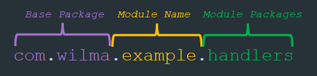

# Help Docs

## App Settings and Active Profiles

[**application.yml**](web/src/main/resources/application.yml) is the main settings/configuration file and can be used by itself, but in this case it is used as a "router" to switch between 3 profiles.

To switch between each of the profiles, go to [application.yml](web/src/main/resources/application.yml) and set the profile you want as the active profile, spring will detect the right file based on whatever follows `application-` in the filename (E.g. `application-prod.yml` has the profile name `prod`)
```yaml
profiles:
 active: h2 # Set this as either aws, h2, or local
```
1. [application-aws.yml](web/src/main/resources/application-aws.yml)
   1. Sets the server port to 5000 (AWS Elastic Beanstalk default)
   2. Has database connection details for a live AWS hosted MySQL database
2. [application-h2.yml](web/src/main/resources/application-h2.yml)
   1. Sets the server port to 8080 (spring boot & h2 default)
   2. Has database connection details for the h2 in-memory database
3. [application-local.yml](web/src/main/resources/application-local.yml)
   1. Sets the server port to the default value (8080)
   2. Has database connection details for a local MySQL database ([user and database setup here](/sql/create-db-and-user.sql))

## Modules
Each module is its own project with its own pom.xml file and declares the project pom `wilma` as its parent, however the `web` module is the 'driver' module to run the application

- Wilma `pom`
  - Web `jar`
  - Config `jar`
  - Entity `jar`
  - Repository `jar`
  - Service `jar`

### For adding a new module to the project:
1. `pom.xml` for a new module called `example`
```xml
<?xml version="1.0" encoding="UTF-8"?>
<project xmlns="http://maven.apache.org/POM/4.0.0"
         xmlns:xsi="http://www.w3.org/2001/XMLSchema-instance"
         xsi:schemaLocation="http://maven.apache.org/POM/4.0.0 http://maven.apache.org/xsd/maven-4.0.0.xsd">
    <modelVersion>4.0.0</modelVersion>
    <packaging>jar</packaging><!-- Packaging must be declared as jar -->

    <parent><!-- Must have the root project (wilma) as the parent -->
        <groupId>com.wilma</groupId>
        <artifactId>wilma</artifactId>
        <version>0.0.1</version>
    </parent>
    
    <!-- Add your module details here -->
    <artifactId>example</artifactId>
    <name>example</name>
    <version>0.0.1</version>
    
</project>
```
2. Check that your module has been added to the [root `pom.xml`](/pom.xml) 
```xml
<modules>
    <module>example</module><!-- Your new module -->
    <module>config</module>
    <module>entity</module>
    <module>repository</module>
    <module>service</module>
    <module>web</module>
</modules>
```
3. Make sure your module package name begins with `com.wilma.the_module_name` so it can be discovered. For example if module "`example`" has a package called `handlers` that contains your handler classes, then the package name would be `com.wilma.example.handlers`. 
    This is because when the application starts it scans the project for all packages, which is defined in the [main class](/web/src/main/java/com/wilma/web/App.java)

    